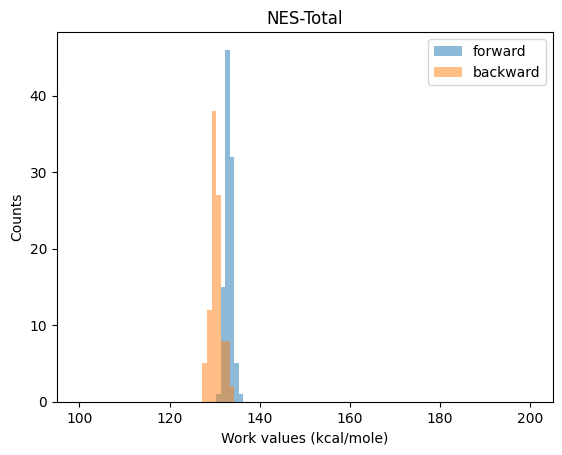
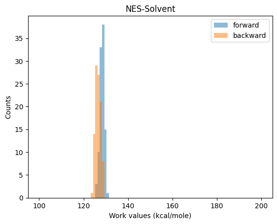

# waterNES

**A reproducible, modular framework for free energy calculations in protein-ligand systems involving trapped/buried water molecules using non-equilibrium switching (NES) and equilibrium free energy simulations.**

The methods implemented here can perform the following free energy calculations:
- Relative binding free energy (RBFE) calculation between two protein-ligand complexes involving trapped/buried water molecules in ligand binding.
  - *This has two versions: a fully NES version (Check thermodynamic cycle 1 below), and an NES + equilibrium free energy calculation version (Check thermodynamic cycle 2 below.).*
- Absolute binding free energy (ABFE) calculation of trapped/buried water molecules in proteins or protein-ligand complexes.
  - *This is performed using NES + equilibrium free energy calculation only (Check thermodynamic cycle 3 below).*
- Fullerene free energy calculations. 
  - *NES free energy calculation of displacing a water molecule from a C<sub>90</sub> fullerene cavity, performed using  free energy calculations.*
  - *Free energy calculation of solvent water equilibration inside a C<sub>90</sub> fullerene cavity using Hamiltonia replica exchange (HREX) simulation.*


## :rocket: Quick start

### RBFE calculation using NES simulations


The following image shows thermodynamic cycle 1 to calculate RBFE between a ligand pair involving trapped water molecules in ligand binding, implementing a non-equilibrium switching (NES)-based workflow.


Here, ligand A is shown in green and ligand B is shown in purple. Both ligands are bound to the protein (shown in yellow). A trapped water is shown in red, while a decoupled trapped water is shown in pale red.
A black cross on the trapped water represents harmonic restraint, a dashed circle around the trapped water represents solvent repulsion potential applied at the binding site of the trapped water.
NES-Total, H and J consitute the complex leg of the RBFE calculation. NES-Solvent represents the solvent leg of the RBFE calculation. 

In the thermodynamic cycle, we simulate the complex and the solvent legs of the RBFE calculation. For the complex leg, we will simulate Stage 1 and Stage 4 for 6 ns. From each of the two trajectories, we extract 100 frames and will launch the NES switches. Each of the NES switches will run for 70 ps (10 ps, 50 ps, 10 ps for NES1, NES2 and NES3, respectively; one NES1, NES2 and NES3 switch constitute one NES-Total switch). For the solvent leg, we will simulate each of the two ligands in solvent for 6 ns and will extract 100 frames from each trajectory. From each frame, we will launch the NES-Solvent switch for 50 ps.

Finally, we will calculate the RBFE between the two ligands from these NES trajectories, using the ```analysis``` module. 

RBFE = $ΔG_{NES-Total} + \Delta G_H + \Delta G_J -  \Delta G_{NES-Solvent}$

## Usage

Here, we are showing how the workflow is used by giving an example of RBFE calculation between ligands C3d and C5d (check Figure 3 of the [RBFE NES Paper](https://pubs.acs.org/doi/full/10.1021/acs.jctc.5c00758) for their structures).   

To start, run the following commands to download the repository and create a conda environment with the necessary packages.

```
git clone git@github.com:MobleyLab/waterNES.git
cd waterNES
conda env create -f environment.yml
conda activate waterNES
```
To run the RBFE calculation, we need two files: a structure of a dual topology structure of the protein-ligand complex (```minimized.gro```) and its GROMACS topology file (```system.top```). Both these files are given for the example case in the folder ```examples/rbfe_nes/sd_c3d_c5d/complex_leg```. Similarly, to run the solvent leg of the calculation, the structure of topology files are saved in ```examples/rbfe_nes/sd_c3d_c5d/solvent_leg```.

Now, we will run the ```run.py``` file that will start the end state simulations of Stage 1 and Stage 4, and the end state simulations of the solvent leg. In each end state run, first the system will be energy minimized, and then will be equilibrated in an NVT and then in an NPT ensemble. If ```posre.itp``` and/or ```posre_ligand.itp``` files are present in the directory (directory structure shown below), then they will be used in the NVT and NPT equilibrations. Finally, 6 ns of production run will be produced starting from the NPT equilibrated structure. The 6 ns trajectory will be divided into 100 structures, each of which will be used to launch NES runs (NES1 -> NES2 -> NES3 for the complex leg, and NES-Solvent for the solvent run). 

```
waternes rbfe submit --config examples/rbfe_nes/config.yaml
```
The run.py will read the ```minimized.gro``` and the ```system.top``` files and will generate the output according to the following directoty structure.

For this example run, we have already performed the simulations, so you don't have to perform the whole runs again (takes around 1.5 hour when run on 20 CPUs and 1 GPU).
The important files are the ```dhdl.xvg``` files generated by the NES switches. We will use these files into the analyze our simulations and calculate the RBFE.

To calculate the RBFE for this example run, we will run the following command:

```
waternes rbfe analyze --config examples/rbfe_nes/config.yaml
```
The ```analysis.py``` script takes in all the ```dhdl.xvg``` as input and calculates the free energies $ΔG_{NES-Total}$ and $ΔG_{NES-Solvent}$ using MBAR calculations.

The expected output of the command is:

```RBFE = -1.97 +- 0.2 kcal/mol```

The following graphs will also be generated, and will be saved in the ```examples/rbfe_nes/sd_c3d_c5d/complex_leg``` and ```examples/rbfe_nes/sd_c3d_c5d/solvent_leg``` folders. These graphs show the histograms of the work values in the forward and reverse NES switches. 






## Citation
If you use our method, code or data, please cite:

1. *[Fullerene free energy calculations]* A Quadrupolar Fullerene Model System for Benchmarking Enhanced Sampling of Trapped Waters in Free Energy Calculations; Swapnil Wagle and David L. Mobley; *J. Phys. Chem. B* **2026**, 130, 2869-2882 ([Fullerene Paper](https://pubs.acs.org/doi/full/10.1021/acs.jpcb.5c08189))

2. *[RBFE trapped/buried waters- fully NES version]* Advancing Binding Affinity Calculations: A Non-Equilibrium Simulations Approach for Calculation of Relative Binding Free Energies in Systems with Trapped Waters; Swapnil Wagle, Christopher I. Bayly and L. David Mobley; *J. Chem. Theory Comput.* **2025**, 21, 7593-7604 ([RBFE NES Paper](https://pubs.acs.org/doi/full/10.1021/acs.jctc.5c00758))

3. *[RBFE trapped/buried waters- NES + equilibrium free energy version,  ABFE of trapped/buried waters]* Leveraging a Separation of States Method for Relative Binding Free Energy Calculations in Systems with Trapped Waters;
Swapnil Wagle, Pascal T. Merz, Yunhui Ge, Christopher I. Bayly and David L. Mobley; *J. Chem. Theory Comput.* **2024**, 20, 11013−11031 ([ABFE-RBFE Paper](https://pubs.acs.org/doi/10.1021/acs.jctc.4c01145))
